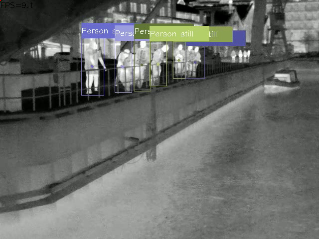
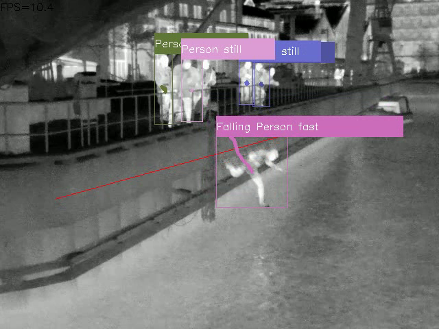

# Master thesis
Done as a Master theis in the subject [TTK4900 - Engineering Cybernetics, Master's Thesis](https://www.ntnu.edu/studies/courses/TTK4900#tab=omEmnet) for NTNU Trondheim  
The thesis was done in collaboration with [Zebop Avalon](https://www.zebopavalon.com/pilot)

## About
A system developed using machine learning to detect a person falling into the water

## Demo
[Demo](https://youtu.be/JNwC5vngN5Q) demonstrating the system

## Pictures
  |     |  

## Report
Soon inc

## License
This project is licensed under the MIT License - see the [LICENSE.md](https://github.com/dr0nn1/masterThesis/blob/main/LICENSE) file for details