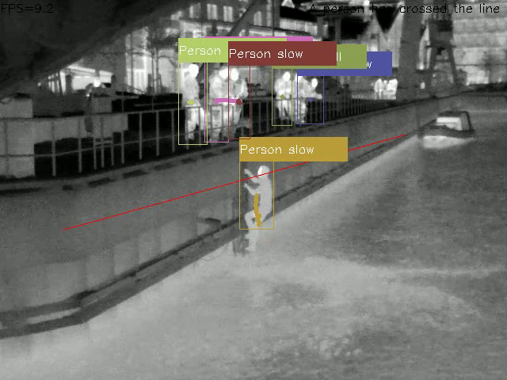

# Master thesis
Done as a Master theis in the subject [TTK4900 - Engineering Cybernetics, Master's Thesis](https://www.ntnu.edu/studies/courses/TTK4900#tab=omEmnet) for NTNU Trondheim  
The thesis was done in collaboration with [Zebop Avalon](https://www.zebopavalon.com/pilot)

## About
A system developed using machine learning to detect a person falling into the water.  
The system uses a custom YOLOv4-tiny model as an object detection model and deep SORT as an object tracker.  
The goal of the system is to detect and report if a person falls into the water, and in this way reduce the number of drowning accidents. 

## Demo
[Demo](https://youtu.be/tMXxFmUmMcw) demonstrating the system

## Pictures
Normal operation | Person climbing the ladder | Person falling |
:-------------------------:|:-------------------------:|:-------------------------:
 |   | 

## Report
[Report](https://github.com/dr0nn1/masterThesis/blob/main/report/thesis.pdf)

## License
This project is licensed under the MIT License - see the [LICENSE.md](https://github.com/dr0nn1/masterThesis/blob/main/LICENSE) file for details
